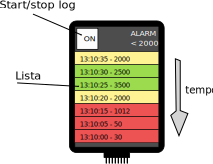

# 2020a - Avaliação Prática 3 

>  Faça o seu trabalho de maneira ética!

- **A cada 30 minutos você deverá fazer um commit no seu código!**
    - Códigos que não tiverem commit a cada 30min ou que mudarem drasticamente entre os commits serão descartados (conceito I) !!
    - Você deve inserir mensagens condizentes nos commits!
- Duração: 3h

Usar como base o lab [RTOS-ADC](https://insper.github.io/ComputacaoEmbarcada/Lab-6-RTOS-ADC/).

## Descrição

Nessa avaliação iremos trabalhar com o LCD max Touch e iremos desenvolver um data logger, esse data logger será um equipamento que **a cada 4 segundos** coleta um novo valor analógico (potenciômetro) o atribui um TimeStamp (RTC) e o exibe no LCD em formato de lista.

:movie_camera: [ASSISTA AO VÍDEO DE COMO TEM QUE FICAR](http://54.162.111.146/shared/embarcados/2020a-av3.mp4) :movie_camera:


### Detalhes do display

A interface a ser desenvolvida possui o formato a baixo:



Onde: 

- ON: é um botão que liga/desliga a aquisição de dados 
- Lista: É o local onde o valor analógico deve ser exibido
    - A cada novo valor, a lista deve ser rotacionada e o valor mais novo colocado no topo da lista. 
    - **7 itens** na lista.
    - novo item a cada **4 segundos**

Cada valor analógico exibido na lista deve ser associado a uma cor, como ilustrado no diagrama e seguindo a escala de cores a seguir:


### alarme

Se todos os itens que estão sendo exibidos no LCD tiverem valor menor que `2000` o alarme deve ser ativado e a interface deve passar a exibir a seguinte tela:


Quando o alarme for ativado o LED da placa deve piscar. O alarme é desativado **somente quando o botão da placa for pressionado**.

### Detalhes do firmware

O código deve ser desenvolvido com o freertos e possuir a estrutura a seguir:

- `task_mxt`: processa o touch do LCD
- `task_lcd`: onde o processamento do touch será realizado
- `task_adc`: task para controlar a aquisição do dado analógico, a cada **4 segundos**
    - `pot_callback`: callback do ADC do potenciômetro, **envia valor do ADC e do TIMESTAMP via fila para a `task_lcd`**.
- `task_alarm`: task de alarme do ADC, pisca LED se alarme ligado
    - `but_callback`: callback do potão da placa que **desliga alarme**
    
A `task_lcd` avisa que a `task_alarm` que o alarme deve ser ativado via um semáforo e a `task_alarm` avisa que o alarme foi desativado por um semáforo.


## Rubricas

Vocês devem gravar um vídeo do firmware funcionando na placa para submeter o projeto.

:triangular_flag_on_post: **Ao finalizar a entrega preencher o formulário (uma única vez!)**

- https://forms.gle/BeiWNWmgndetFJWd6

> Dica: usar o forms de TODO LIST!

### Dicas

Dicas gerais:

1. Faça o desenvolvimento por partes e testa de forma incremental.
1. Travou? Não funciona? **Debugou!** e ainda não funciona? Nome na fila!

- Para escrever no LCD use a função `ili9488_draw_string` que escreve com o fundo certo (precisa lembrar de configurar a cor antes `ili9488_draw_filled_rectangle`.

- Estruture os dados da fila em um struct:

```
struct t_log {
  char ts[32];
  int32_t adc;
};
```

### C

- [ ] segue a estrutura de firmware especificada (semáforos e filas)
    - **fila entre callback do AFEC envia valor do ADC e TimeStamp**
- [ ] exibi a lista atualizada a cada 4 segundos
- [ ] usa RTC como relógio / timestamp
    - valor é enviado junto com o ADC na fila
- [ ] exibe o item na lista seguindo a escala de cores
    - time stamp + valor
- [ ] botão de on/off da captura de dados
- [ ] exibe tela de alarme se todos itens da lista ficarem a baixo de 2000
- [ ] pisca LED na **task_alarm** se alarme for ativado 
- [ ] alarme é desativado por botão da placa
    - led para de piscar
    - volta exibir a lista

### C+ 

- [ ] tela não deve "piscar" inteira, atualização no LCD somente onde é necessário
- [ ] quando em modo alarme deve parar a aquisição de novos dados do AFEC. 
- [ ] utiliza RTT no lugar da `task_adc` para fazer o controle da conversão do AFEC

### B

- [ ] não utiliza variáveis globais
    - somente variáveis do RTOS (fila, semáforo, ...)
- [ ] usa vetor de `struct t_log` para armazenar os dados da lista:
- [ ] tamanho da fila é configurado por um `#define` 

### B+

- [ ] texto `"Alarm \n <2000"` deve virar um botão que altera o nível do alarme. Cada vez que o botão for apertado o valor muda entre um disponível na lista: `[1500, 2000, 2500]`. Esse novo valor deve ser o `threshold` para o alarme e isso inclui as escalas de cor (qual item que fica vermelho).


### A

- código estruturado em funções 
    - exemplo: função para calcular o alarme
    - função para desenhar a lista
    - função para inserir um novo valor e rotacionar a lista
- cria .h e .c para estruturar código
